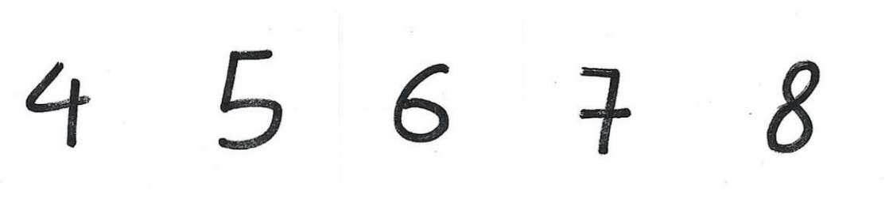
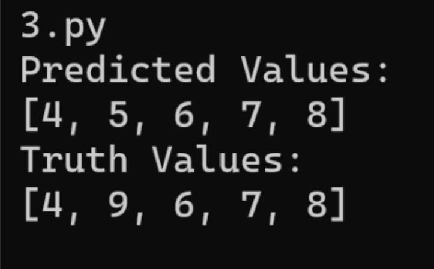

# Digit Recognition with CNN
This project implements a Convolutional Neural Network (CNN) for handwritten digit recognition using the MNIST dataset. The model follows the LeNet architecture and achieves 95.6% accuracy on the test set.

## Overview
The model is built with multiple layers:
* Convolutional layers for feature extraction
* ReLU activation for non-linearity
* Max Pooling layers for downsampling
* Fully connected layers for classification
The system was trained using Mini-batch Stochastic Gradient Descent (SGD) and tested on real-world handwritten digits.

## Tools
* Python
* NumPy, SciPy, Matplotlib
* OpenCV (cv2) for real-world digit extraction
* CNN implementation with forward and backward propagation

## Results
Test accuracy: 95.6%. 

Real-world handwritten digit recognition: 80% accuracy on self-written digits.

## Example output:
Handwritten Digit Recognition Results
Digits:

Results (80% accuracy): 

